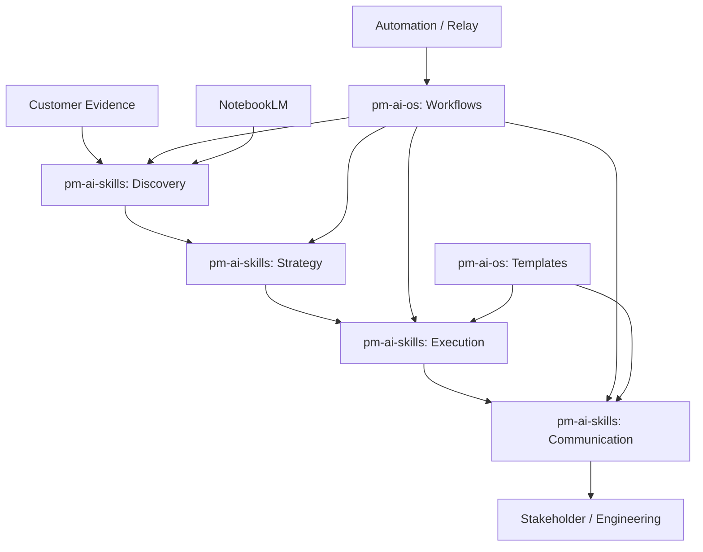

# System Diagram

> Starter file. Add your architecture diagram here (Mermaid or linked image).

## High-level architecture

## Notes

- Replace this diagram with your actual system architecture.
- Use Mermaid for version-controlled diagrams or link to a Figma/Miro board.
